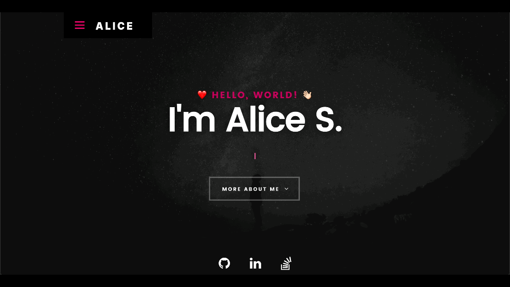
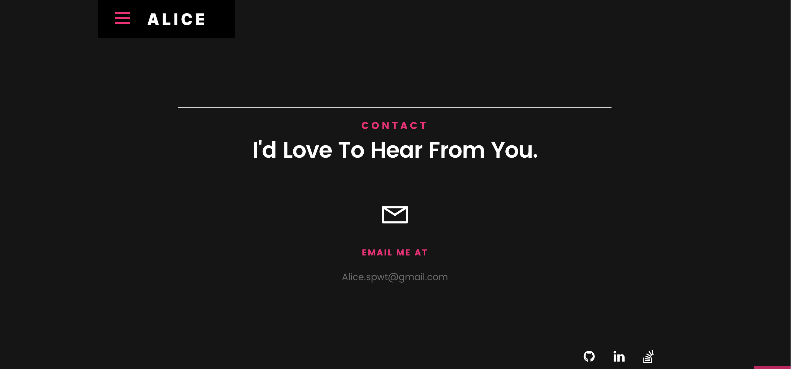

# alicec0874203.github.io
Alice's Portfolio website

# My Portfolio Site ✨
> https://alicec0874203.github.io/

⭐ Don't forget to star this repo on GitHub — it means a lot!

### Website Sneak Peek
#### Landing Page

#### About Section

#### Contact Section

⭐ Don't forget to star this repo on GitHub — it means a lot!

## Features 📋
⚡️ Fully Responsive\
⚡️ HTML5 & CSS3\
⚡️ Typing animation powered by `Typed.js`\
⚡️ Simple to customize

## Setup & Deployment 📦
- Clone the repo and edit the content of <b>index.html</b>
- Add or remove images in the `images` folder as needed.
- Update the `portfolio` folder with your own content.
- Use [GitHub Pages](https://pages.github.com/) to launch your site.
- To deploy your site, create a GitHub repository named `<your-github-username>.github.io` and push the modified code to the `master` branch.

## Sections 📚
✔️ Home\
✔️ About (Profile, Skills, Resume Download)\
✔️ Resume (Work Experience & Education)\
✔️ Portfolio\
✔️ Contact Information

## Technologies Used 🛠️
* <b>GitHub Pages</b> - To host the static website (HTML, CSS, JS).

## How to Contribute 💡
#### Step 1

- **Option 1**
    - 🍴 Fork this repository!

- **Option 2**
    - 👯 Clone this repository to your local machine.

#### Step 2

- **Code away!** 🔨🔨🔨

#### Step 3

- 🔃 Submit a new pull request.

## License

- **[MIT license](http://opensource.org/licenses/mit-license.php)**
